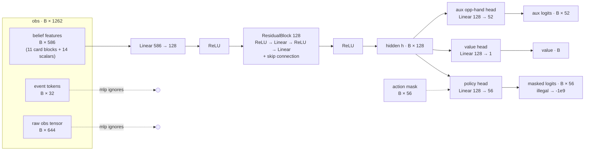

# Network architecture (Phase 5: `mlp` torso, full deck)

`GinNet` in `src/ginrl/nets/gin.py`. Forward pass, batch of B decisions:

Shapes (full deck: `deck=52`, `feat_dim=586`, `event_window=32`):

| stage | shape | params |
|---|---|---|
| obs in | B × 1262 (586 feat + 32 events + 644 raw) | – |
| Linear + ReLU | 586 → 128 | 75,136 |
| ResidualBlock(128) + ReLU | 128 → 128 | 33,024 |
| policy head (+ mask) | 128 → 56 learned actions | 7,224 |
| value head | 128 → 1 | 129 |
| aux opponent-hand head | 128 → 52 cards | 6,708 |
| **total** | | **122,221** |

Notes:

- The 56 learned actions are knock/pass/draw/discard decisions; the 185
  meld declarations are solved exactly by `GinRummyUtils`, not learned.
- The aux head predicts the opponent's hidden cards (multilabel); it backs
  a tripwire and the Phase 6 inspectability story — it does not drive play.
- Four sibling torsos (`set`, `seq`, `raw`, `hybrid`) share this head
  contract; Phase 4 picked `mlp` and Phase 5 trains it. See `gin.py`.
- Everything is float32 (MPS has no float64).
