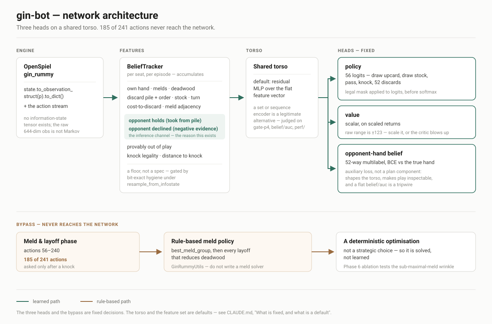

# gin-bot

A Gin Rummy agent trained by regularised self-play on
[OpenSpiel](https://github.com/google-deepmind/open_spiel), in PyTorch, on Apple
Silicon — plus an evaluation stack built to answer a question that head-to-head
win rates cannot: **is it better to knock early, hold out for gin, or play
balanced?**

## What this is

- **Engine:** OpenSpiel 2.0 `gin_rummy` (C++, exposed to Python via `pyspiel`).
- **Learner:** one regularised policy-gradient trainer covering PPO-with-entropy,
  magnetic mirror descent, and an EMA-magnet variant — the family that recent
  controlled studies find matches or beats CFR-, fictitious-play- and
  double-oracle-based deep methods in two-player zero-sum imperfect-information
  games.
- **Representation:** hand-engineered features over OpenSpiel 2.0 observation
  structs, with an explicit history tracker for the inference channel (what the
  opponent took from the pile, what they declined) — because OpenSpiel provides
  no information-state tensor for this game and the per-step observation is not
  a sufficient statistic.
- **Unit of play:** the **match** to 100 points, not the single hand OpenSpiel
  implements — the same target as the EAAI Gin Rummy Challenge, and the only
  setting in which "knock early or hold for gin" has its real answer, since the
  optimal knock threshold moves with the score.
- **Evaluation:** duplicate-deal head-to-head with confidence intervals, RL
  best-response bounds on exploitability calibrated against exactly-known
  Kuhn/Leduc values, and clone-invariant Nash averaging over a population of
  deliberately-styled agents. Benchmarks are `SimpleGinRummyBot` (the anchor)
  and `ISMCTSBot` at a ladder of fixed search budgets.
- **Observability:** live Trackio dashboard (local, no account) over a JSONL
  source of truth. Ratings are anchored Bradley-Terry with error
  bars, refit over the entire game record — and shipped with a cyclic-structure
  diagnostic, because a rising Elo in a self-play league is not by itself
  evidence of progress.



Design rationale is in [METHODOLOGY.md](METHODOLOGY.md). The build order and its
acceptance gates are in [IMPLEMENTATION_PLAN.md](IMPLEMENTATION_PLAN.md).
Telemetry and rating design is in [docs/OBSERVABILITY.md](docs/OBSERVABILITY.md).
Every non-obvious choice, gate-failure diagnosis and landmine is recorded in
[docs/DECISIONS.md](docs/DECISIONS.md).

## Quickstart

Requires [uv](https://docs.astral.sh/uv/). Never `pip install` into this project.

```bash
make setup     # uv sync, probe the environment, write generated facts
make test      # unit and property tests (< 60s)
make gate-p0   # the current phase's acceptance gate
make status    # phase, gate results, ratings, run provenance
```

`make gate-all` runs every gate in order and is the release check.

## Facts worth knowing before you read the code

Verified against OpenSpiel 2.0.2, not assumed:

- 241 actions: `0–51` discard, `52` draw upcard, `53` draw stock, `54` pass,
  `55` knock, `56–240` meld declarations. Observation tensor is 644 floats.
- **No information-state tensor.** `information_state_tensor()` raises.
- Roughly 390 of the 644 observation dims are always zero in normal play.
- `pyspiel.gin_rummy.GinRummyUtils` already implements deadwood and meld search —
  we do not write our own.
- `SimpleGinRummyBot` is stateful, needs `inform_action` for opponent and chance
  moves, and does not implement `restart_at` — construct a fresh pair per game.
- Reduced decks work (`num_ranks`, `num_suits`, `hand_size`), subject to
  `num_ranks * num_suits >= 2*hand_size + WALL_STOCK_SIZE + 1` (`WALL_STOCK_SIZE
  == 2`), but the action and observation spaces stay padded at full size.
- Exact exploitability is infeasible for gin rummy at every size; it is used only
  on Kuhn and Leduc, to validate the trainer.


## Results


Every number below is read from `runs/<run>/metrics.jsonl`, never from a
dashboard. Regenerated by `make gate-all`.

| Measure | Result |
|---|---|
| Champion vs `SimpleGinRummyBot` | _pending_ |
| Champion vs tuned heuristic | _pending_ |
| RL-BR exploitability bound | _pending_ |
| Final Elo vs `SimpleGinRummyBot` (anchor = 0) | _pending_ |
| Rating cyclic fraction | _pending_ |
| Equilibrium gin rate | _pending_ |
| Match win rate vs `SimpleGinRummyBot` | _pending_ |
| Knock threshold shift, behind vs ahead | _pending_ |
| Winning torso (Phase 4 bake-off) | _pending_ |
| Nash-averaging support set | _pending_ |
| Cyclic energy of the population | _pending_ |

