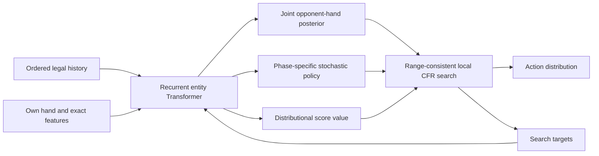
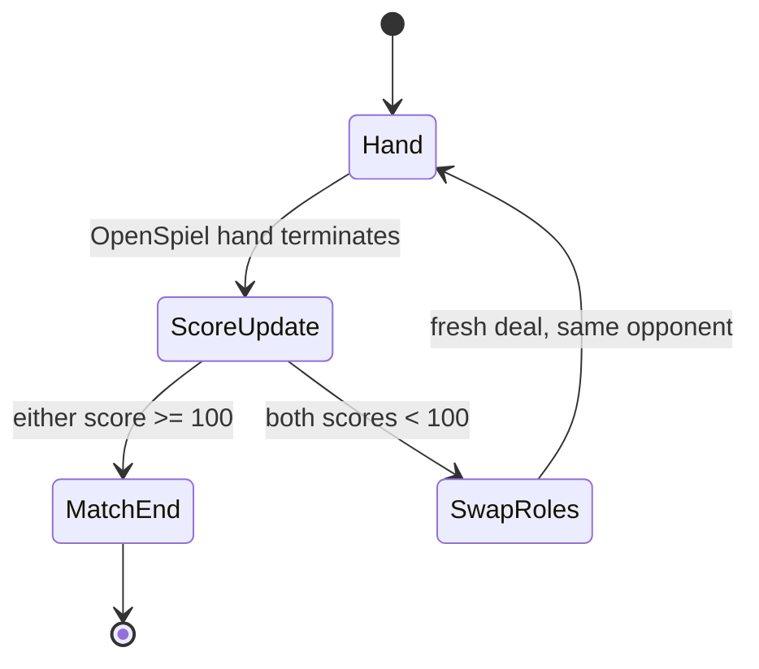
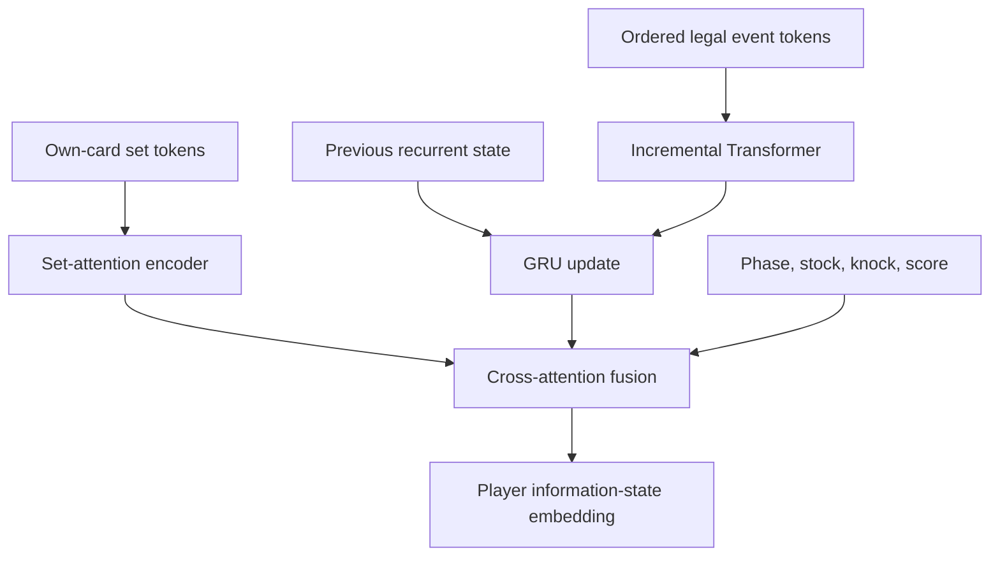
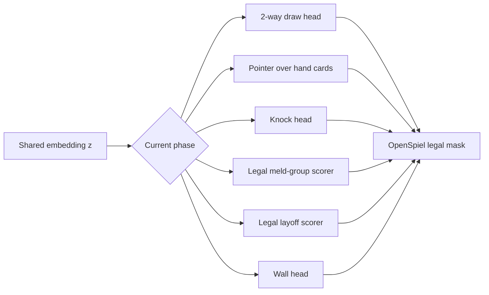
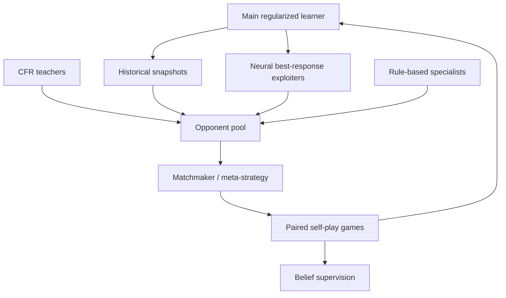
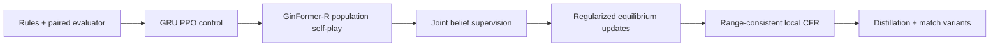
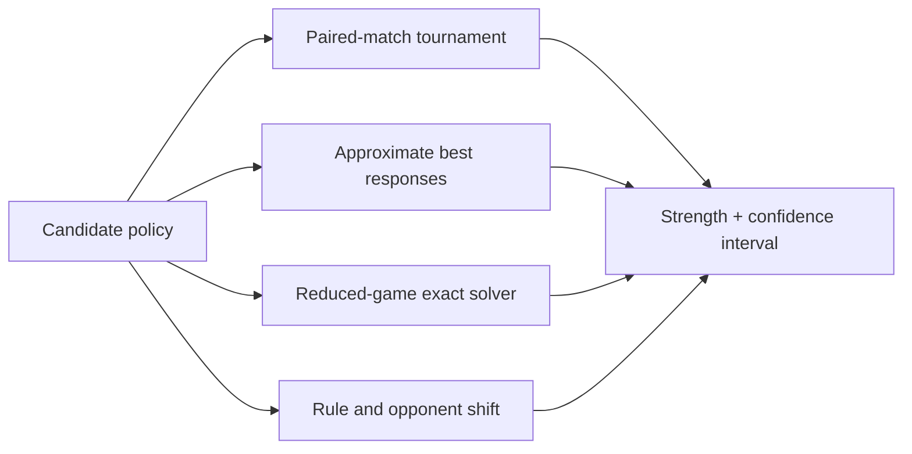

# An Ideal Gin Rummy RL System
 
> A research design for PyTorch, OpenSpiel, and one strong workstation.
 
**Snapshot:** 8 September 2026. This is a reasoned blueprint, not a claim that a
published system has solved full Gin Rummy. The design combines the most relevant
ideas from recurrent self-play, counterfactual regret minimization, public-belief
search, regularized game dynamics, and neural card representations.
 
## 1. Executive recommendation
 
The strongest plausible system on a 64 GB M5 Max or a PC with a Ryzen 9 9950X,
64 GB RAM, and an RTX 5080 is not one monolithic RL algorithm. It is a
**belief-aware strategy-and-search system** with four layers:
 
1. A compact **recurrent card/entity Transformer** represents the player's hand,
   exact ordered history, public cards, stock size, and first-to-100 match state.
2. A supervised **joint opponent-hand belief model** learns from hidden cards
   available only as training labels. It supplies coherent posterior samples,
   not merely 52 independent probabilities.
3. An equilibrium-oriented **stochastic policy** is trained by regularized
   self-play against a checkpoint population. Magnetic mirror-descent or
   R-NaD-style updates are the ambitious target; recurrent PPO is the engineering
   control baseline.
4. A **range-consistent local solver** optionally improves difficult decisions at
   inference. It searches over a weighted set of possible opponent hands and
   updates one strategy for the whole range with sampled CFR. Search targets are
   distilled back into the fast policy.

 
This is deliberately **not AlphaZero for cards**. AlphaZero's ordinary state-tree
MCTS assumes the state being searched is known. Gin Rummy decisions must remain
consistent across hidden hands that the player cannot distinguish.
 
### The main hypothesis
 
At equal inference latency, an explicit history-conditioned joint belief plus
population self-play should outperform a larger observation-only policy in
first-to-100 matches. Adding range-consistent local solving should improve knock,
stock-versus-upcard, and defensive discard decisions without reducing match win
rate against approximate best responses.
 
That claim is falsifiable through the ablations in [Section 16](#16-decisive-ablations).
 
## 2. What “optimal” can and cannot mean
 
OpenSpiel models one Gin Rummy hand as a finite, sequential, stochastic,
imperfect-information, two-player zero-sum game. This design composes hands into
a **first-to-100 match**, which is the actual training and deployment episode. In
principle, that finite repeated game also has a Nash equilibrium when the complete
match history and score are part of each player's information state. In practice,
even one full hand has more than $10^{85}$ information states, and the opening
deal leaves
 
$$
{41 \choose 10}=1{,}121{,}099{,}408
$$
 
possible opponent hands. Exact solution is not realistic on one workstation.
 
Therefore distinguish three goals:
 
- **Game-theoretic goal:** minimize exploitability of the score-conditioned
  average strategy in the repeated match game.
- **Playing-strength goal:** maximize paired first-to-100 match win probability
  against a broad held-out population.
- **Product goal:** deliver a strong action within a fixed latency and memory
  budget.
The proposed system optimizes all three, but cannot certify full-game optimality.
Exact exploitability is measured only in reduced-deck games. In the full game,
approximate best responses and adversarial populations provide lower bounds on
how exploitable the policy is.
 
## 3. OpenSpiel reality check
 
The current OpenSpiel implementation provides an unusually good foundation, but
several details control the design.
 
### What it provides
 
- A correct C++ rules engine exposed through `pyspiel`.
- Standard Gin and Oklahoma parameters, including knock, gin, and undercut
  bonuses.
- Configurable rank count, suit count, and hand size for reduced-game curricula.
- Explicit chance nodes for the deal and stock draws.
- Zero-sum terminal point returns for one hand, from which a match wrapper can
  recover the winner's awarded points.
- Legal draw, discard, knock, meld, layoff, wall, and pass actions.
- Python access to phase, upcard, stock size, hands, known cards, discard pile,
  deadwood, knock state, laid melds, and layoffs.
- A simple rule-based Gin Rummy bot for baseline evaluation.
For the standard game, OpenSpiel exposes 241 action IDs:
 
| IDs | Meaning |
|---|---|
| `0..51` | Card-index actions, including discards where legal |
| `52` | Draw the upcard |
| `53` | Draw from stock |
| `54` | Pass |
| `55` | Knock |
| `56..240` | 185 encoded meld actions |
 
The default observation tensor has 644 values. It includes player/turn features,
hand channels, knock card, upcard, discard membership, stock size, and laid
melds.
 
### What must not be assumed
 
1. **The default observation is not perfect recall.** Its discard-pile channel is
   a 52-card membership vector, not the ordered sequence of pickups and discards.
   Order is highly informative about the opponent's hand.
2. **There is no advertised perfect-recall information-state tensor.** Build a
   custom history representation from legal observations and actions.
3. **The built-in `resample_from_infostate` is not a posterior model.** OpenSpiel's
   source states that it samples uniformly from unseen cards, preserves publicly
   known pickups, ignores the evidential content of action history, and
   invalidates state history. It is acceptable for a naive baseline, not the
   proposed search system.
4. **The environment is one hand, not a match to 100 points.** The proposed
  system therefore requires a first-class wrapper that carries scores,
  dealer/first-player role, opponent identity, and match history across newly
  dealt OpenSpiel states. This wrapper is required from the first baseline; it
  is not an optional final extension.
5. **Reduced-deck parameters need a custom encoder.** Do not hard-code the
   standard 644-vector layout and assume it transfers unchanged to all rank,
   suit, and hand-size curricula.
These are not minor integration notes. They determine what information the
network can legally learn, whether search is strategically sound, and whether the
learned objective is winning a match rather than maximizing an isolated hand.
 
## 4. The first-to-100 match wrapper
 
The wrapper is part of the environment definition, not merely evaluation code.
Use a configuration such as:
 
```yaml
target_points: 100
max_hands: 200
alternate_first_player: true
gin_bonus: 25
undercut_bonus: 25
oklahoma: false
post_target_game_bonus: 0
post_target_shutout_bonus: 0
box_bonus_per_hand: 0
utility: match_win
```
 
Gin scoring conventions vary. Freeze these fields in every experiment. If the
intended rules include a 100-point game bonus, shutout bonus, or box bonuses, add
them explicitly for reporting or a score-differential objective. They do not
change who first reaches 100, but they do change final-score utility.
 
### Match transition
 
Let OpenSpiel return one hand as $(r,-r)$. Exactly one player receives positive
hand points unless the hand is drawn. Update nonnegative cumulative scores by
 
$$
(S_0',S_1')=
\begin{cases}
(S_0+r,S_1), & r>0,\\
(S_0,S_1-r), & r<0,\\
(S_0,S_1), & r=0.
\end{cases}
$$
 
The match terminates as soon as $S_i'\ge100$. For the primary `match_win`
objective, return $+1$ to the winner and $-1$ to the loser. Start a fresh
`pyspiel.load_game("gin_rummy", ...)` state after every nonterminal hand, map
OpenSpiel player IDs through an explicit match-seat mapping, and alternate the
first-player/dealer roles according to the chosen rules.
 
Although ordinary play reaches 100, an adversarial sequence of drawn hands could
make the repeated environment unbounded. Set a high `max_hands` safety limit to
make training episodes formally finite. At the limit, award the match to the
higher score or return a draw at equal scores. Report every cap hit; a non-negligible
rate indicates a policy or rules problem rather than a normal match outcome.
 

 
### Match information state
 
Every policy decision receives only legally known information, plus:
 
- own and opponent cumulative score;
- points each player needs to reach 100;
- score lead and normalized score pair;
- current hand number;
- first-player/dealer role for this hand;
- rule/bonus configuration;
- summaries of publicly observed opponent behavior in earlier hands.
Maintain two memories:
 
- **hand memory**, reset after each hand, for exact pickup/discard evidence;
- **match memory**, reset only after the match, for opponent-style adaptation.
The opponent policy is sampled once per **match**, not once per hand. Otherwise
the match history describes several incompatible opponents and cannot support
rational adaptation.
 
### Match-aware objective
 
Expected hand points and match win probability are not interchangeable. At
$S=(99,0)$, a low-variance one-point knock can be preferable to a line with
higher expected hand points but lower probability of scoring at all. The primary
critic must therefore estimate
 
$$
V^{match}(h_t,S_0,S_1)=
\Pr(\text{win match}\mid h_t,S_0,S_1)-
\Pr(\text{lose match}\mid h_t,S_0,S_1).
$$
 
Hand score remains an auxiliary target. A second boundary critic estimates match
equity immediately after a hand from the updated score, next role, opponent
summary, and rules. This provides lower-variance bootstrapping across hands while
the unbiased Monte Carlo match outcome remains the principal target.
 
## 5. The proposed model: GinFormer-R
 
Call the backbone **GinFormer-R**: a recurrent, range-aware entity Transformer.
It is intentionally small enough that self-play throughput, rather than GPU
memory, remains the main budget.
 
### Recommended full model
 
| Component | RTX 5080 16 GB target | M5 Max 64 GB target |
|---|---:|---:|
| Card/entity width | 256 | 256 |
| Event Transformer | 8 layers, 8 heads | 8 layers, 8 heads |
| Feed-forward width | 1,024 | 1,024 |
| Recurrent summary | 2-layer GRU, width 256 | 2-layer GRU, width 256 |
| Context length | Last 128 events + recurrent prefix | Last 128 events + recurrent prefix |
| Parameter target | Roughly 20-35M | Roughly 20-35M |
| Training precision | BF16 mixed precision | BF16/FP16 where MPS operations permit |
 
The exact parameter count is not sacred. A 15M model trained against a diverse
population is likely more useful than a 100M model trained against only its latest
copy.
 
### Why combine recurrence and attention?
 
- The GRU carries a cheap summary across a potentially long hand.
- The Transformer can revisit precise recent evidence: an opponent picked up
  `7h`, later discarded `9h`, and repeatedly declined nearby cards.
- Truncated replay can retain a burn-in prefix for the recurrent state while
  attending exactly over recent events.
- Online inference remains incremental rather than re-encoding the full hand on
  every decision.
Pure recurrence is the first baseline. Pure full-history attention is the
ablation. The hybrid is the expected final model, not an assumption to protect
from evidence.
 
## 6. Input representation
 
### Card identity
 
Represent each card with additive embeddings for:
 
- rank;
- suit;
- absolute card ID;
- zone: own hand, upcard, discard, known opponent card, laid meld, or unknown;
- ownership/actor;
- recency or event position;
- provenance: dealt, stock draw, upcard pickup, discard, meld, or layoff.
Absolute card embeddings allow idiosyncratic patterns. Rank and suit embeddings
allow sharing and suit-permutation augmentation.
 
### Own-hand set
 
Own cards are an unordered set, so encode them with shared card tokens and
self-attention without arbitrary hand-order positions. Add exact deterministic
features from `GinRummyUtils` or an equivalent dynamic program:
 
- minimum deadwood;
- every legal meld and compatible meld group;
- each card's deadwood delta if discarded;
- run potential by suit and rank gap;
- set multiplicities by rank;
- whether knocking or gin is currently possible;
- layoff exposure if the opponent knocks.
These features do not “cheat.” They are deterministic functions of legally known
cards. Asking a neural network to rediscover exact meld combinatorics wastes data
and introduces avoidable errors.
 
### Ordered event stream
 
Create one token per public or own-private event:
 
```text
(turn, actor, phase, action_type, card, source, stock_size,
 first_upcard_state, knock_limit, public_score_context)
```
 
Include:
 
- initial upcard and each pass;
- who drew from stock or took the upcard;
- every public discard in order;
- the observing player's privately seen stock draw;
- knock, meld, and layoff events;
- rule variant, both cumulative scores, points-to-go, and current hand role.
For an opponent's stock draw, encode `UNKNOWN_STOCK_CARD`, never the true card.
Generate the stream from each player's legal observation history, not from the
omniscient OpenSpiel state struct.
 
### Public scalar context
 
Embed stock size, knock limit, current phase, player to act, first-upcard pass
state, dealer/first player, hand number, both match scores, points-to-go, and score
lead. Normalize scalar values or encode small integers with learned embeddings.
Fuse the hand-level representation with the persistent match-memory token.
 

 
## 7. The belief model is the key differentiator
 
The agent needs a posterior over the opponent's **phase-conditioned private
state**, not merely guesses about isolated cards. The opponent normally holds ten
cards after discarding, but temporarily holds eleven after drawing. Knock, meld,
layoff, wall, and terminal phases need explicit state contracts. Belief targets
and search particles must use the phase-correct hand size and fields.
 
### Why independent card probabilities are insufficient
 
Marginals can say every unseen card has probability $10/41$, but a hand is a
size-constrained set. Meld structure creates strong dependencies: believing the
opponent holds `5h` and `6h` changes the probability and strategic significance
of `4h` and `7h`. Public pickups create hard inclusions until those cards are
discarded.
 
### Joint posterior design
 
Use an autoregressive set decoder over unseen cards:
 
$$
p_\phi(H_{opp}\mid h_t)
=\prod_{j=1}^{m}
p_\phi(c_j\mid c_{<j},h_t),
$$
 
with canonicalized generation or order-marginalized training so that the result
models a set rather than a meaningful card order. Enforce:
 
- exactly the phase-correct opponent hand size;
- no duplicate cards;
- exclusion of own and public cards;
- inclusion of known upcard pickups still held;
- removal of observed opponent discards.
A practical alternative is weighted sampling without replacement from contextual
card logits, followed by a small energy model that reweights complete hands for
meld coherence. Keep 52 marginal logits as an auxiliary calibration output, but
use complete hand samples for search.
 
### Training signal
 
During self-play, the simulator knows the true opponent hand. Use it only as a
label for:
 
- complete-hand negative log likelihood;
- per-card binary cross-entropy;
- opponent deadwood bucket;
- meld-pattern class or learned hand embedding;
- next public opponent action.
The policy never receives the hidden truth at inference. Add an automated
information-flow test that replaces hidden cards while holding the player's
information state fixed and verifies identical policy logits.
 
### Belief quality metrics
 
- Negative log likelihood of the true complete hand.
- Brier score and expected calibration error for card marginals.
- Recall of the true phase-conditioned private state under $K$ posterior
  particles.
- Effective sample size after action-likelihood reweighting.
- Decision value: score gained by using learned versus uniform beliefs.
Posterior likelihood alone is not enough. A slightly miscalibrated belief may be
decision-sufficient; a well-calibrated marginal model may still sample incoherent
hands.
 
## 8. Phase-specific policy heads
 
A flat 241-way output is a valid baseline but a poor final inductive bias. Most
actions are irrelevant in most phases.
 
Use shared state representation $z_t$ with phase-specific heads:
 
1. **First upcard:** take or pass.
2. **Draw:** take upcard or stock.
3. **Discard:** pointer score over the 11 cards currently in hand.
4. **Knock:** knock or continue/discard as represented by the engine's phase.
5. **Meld declaration:** score complete legal meld-group candidates generated by
   exact combinatorics, then emit the OpenSpiel meld action sequence.
6. **Layoff:** score legal card-to-meld layoff candidates plus stop/pass.
7. **Wall:** pass or knock.

 
For compatibility, an adapter maps structured distributions back to OpenSpiel's
241 action IDs. The rules engine remains the final authority on legality.
 
Keep the policy stochastic. Predictable pickup, discard, and knock behavior can
be exploited even if its average hand evaluation is strong.
 
## 9. Value and auxiliary heads
 
### Match equity and hand-score distribution
 
The primary value head predicts match win/draw utility from the current score and
history. A secondary head predicts the distribution of points awarded in the
current hand. Use categorical support over attainable hand scores or quantile
regression:
 
$$
Z_\theta(h_t,a_t) \approx
\mathcal{L}(G_t\mid h_t,a_t).
$$
 
The match-equity head trains decisions. The hand-score distribution captures
gin/undercut tails and improves the boundary value after applying the first-to-100
score transition. This makes score-dependent risk preferences emerge from the
objective rather than from a hand-tuned risk penalty.
 
### Counterfactual particle value
 
For local solving, evaluate each sampled private-state particle and candidate
continuation strategy. Condition the value network on:
 
- public history embedding;
- own hand;
- sampled opponent hand during solver-only evaluation;
- ranges or particle weights;
- continuation-policy identifier if the leaf model supports several responses.
This solver value may use omniscient sampled states internally because the solver
integrates them into one range-consistent strategy. The deployed action must not
condition directly on which particle is true.
 
### Auxiliary predictions
 
- own minimum deadwood after each legal action;
- opponent deadwood distribution;
- probability opponent can knock within 1, 2, or 3 turns;
- probability each discard helps an opponent meld;
- final outcome type: gin, knock, undercut, wall draw;
- match win probability after each possible hand-score transition;
- remaining hand length;
- next public action and card;
- value at several horizons.
Auxiliary weights should be uncertainty-scaled or gradually annealed. Ablate every
head; an easily predicted target is not necessarily strategically useful.
 
## 10. Training objective: regularized equilibrium self-play
 
### Why not plain PPO alone?
 
PPO is the fastest credible baseline, but latest-policy PPO self-play can cycle,
forget old counters, and collapse necessary mixing. Gin Rummy is exactly the
two-player zero-sum imperfect-information setting where equilibrium-aware updates
deserve priority.
 
The 2026 frontier is revisiting policy gradients through **magnetic mirror
descent** and identifying weaknesses in standard GAE for imperfect-information
self-play. These are promising developments, not yet a turnkey Gin Rummy recipe.
The engineering plan should therefore maintain two trainers:
 
- **Control:** recurrent PPO with complete Monte Carlo match outcomes, legal
  masks, a hand-boundary match-equity baseline, KL control, entropy
  regularization, and historical opponents.
- **Target:** magnetic mirror-descent or R-NaD-inspired regularized updates with
  an average policy and population evaluation.
Exact terminal **match** outcomes avoid GAE bias at the cost of higher variance
and longer episodes. Use the hand-boundary match-equity critic for variance
reduction, but periodically train it against complete Monte Carlo match outcomes.
Do not treat the terminal score from one hand as the episode return.
 
### Conceptual target
 
Use a KL-regularized objective around an anchor policy $\rho$:
 
$$
\max_{\pi_i}
u_i(\pi_i,\pi_{-i})
-\tau\,
\mathbb{E}_{h\sim\pi}
\left[D_{KL}(\pi_i(\cdot\mid h)\|\rho_i(\cdot\mid h))\right].
$$
 
The anchor and regularization schedule stabilize the game dynamics. Update both
roles symmetrically, maintain a streaming average strategy, and periodically
re-anchor or solve the next regularized game as prescribed by the chosen method.
 
### CFR teacher
 
In parallel, train outcome-sampling Deep CFR or advantage-based regret matching
on reduced games and selected full-game subgames. It serves three purposes:
 
- an equilibrium-oriented teacher for hard information states;
- a diagnostic against policy-gradient pathologies;
- a source of counterfactual action targets for distillation.
Trying to run full-tree CFR on standard Gin Rummy is not the proposal. Chance and
information-state scale make sampled traversal and function approximation
mandatory.
 
## 11. Population and curriculum
 
### Reduced-game curriculum
 
OpenSpiel's `num_ranks`, `num_suits`, and `hand_size` parameters make a principled
curriculum possible:
 
1. Tiny games that exact CFR can solve.
2. More ranks, preserving suit/run structure.
3. More suits and larger hands.
4. Standard 52-card, ten-card Gin.
5. Oklahoma Gin and varied knock/bonus settings.
6. Full first-to-100 matches throughout, followed by Oklahoma and scoring-rule
  variants once the standard match policy is stable.
Do not merely pretrain tiny and fine-tune large. Continue mixing reduced games
during training so exact exploitability remains a live regression test.
 
### League composition
 
Maintain:
 
- current main learner;
- exponential-moving average or explicitly averaged strategy;
- immutable historical checkpoints;
- CFR/Deep-CFR teachers from reduced and local games;
- best-response exploiters trained against the main policy;
- specialist bots: aggressive knock, conservative gin, pickup baiting, and
  defensive discard;
- OpenSpiel's simple bot and random policy.

 
Matchmaking should blend:
 
- 35% current or averaged policy;
- 30% historical snapshots weighted by learning progress;
- 20% exploiters and specialists;
- 15% meta-strategy or uniform coverage.
These are initial values to tune, not theoretical constants. Sample the opponent
once per match; changing policies between hands makes cross-hand adaptation and
the match value target incoherent.
 
## 12. Range-consistent local search
 
### Where search is likely valuable
 
Search every move only after profiling. It is most likely to pay for:
 
- take-upcard versus stock decisions with strong public evidence;
- defensive discards when several cards have similar own-hand value;
- knock versus continue decisions;
- late-hand play with a small stock and concentrated posterior;
- match-score situations where tail outcomes matter.
### Search state
 
Construct $K$ complete opponent-state particles from the learned posterior and
assign weights directly from normalized
$p_\phi(H_{opp}\mid h_t)$. Add an observed-action likelihood only when the prior
is explicitly conditioned on public card history **excluding** the action
evidence used in that likelihood; otherwise it double-counts evidence already in
$h_t$. Ablate posterior-only weighting against any separately factored
action-likelihood model. The particles collectively represent one public
information state.
 
### Solver
 
Use depth-limited external-sampling CFR or growing-tree CFR:
 
1. Maintain regrets and average strategy keyed by public history, acting player,
  that player's private hand abstraction or embedding, and cumulative match
  score.
2. Sample chance draws without replacement inside each particle.
3. Traverse all candidate actions for the updating player where affordable.
4. Keep strategy decisions tied across states in the same information set.
5. At the depth limit, evaluate match-equity counterfactual values for all
  retained particles. If search reaches a hand ending, apply the score transition
  and query the hand-boundary match critic rather than stopping at hand points.
6. Return the root **average strategy**, not a different best action for each
   sampled opponent hand.
Typical starting budgets:
 
| Mode | Particles | CFR traversals | Intended use |
|---|---:|---:|---|
| Fast | 64 | 256-512 | Interactive play on M5 Max |
| Standard | 128 | 1,000-2,000 | RTX 5080, latency to be benchmarked after optimization |
| Analysis | 512+ | 10,000+ | Offline labels and difficult-position analysis |
 
These latency expectations must be benchmarked; Python tree bookkeeping may
dominate unless the traversal core is C++ or vectorized.
 
### What not to do
 
- Do not call `resample_from_infostate`, solve each result as perfect information,
  and vote.
- Do not use the actual opponent hand to choose the deployed action.
- Do not let leaf values assume one fixed opponent response if the root strategy
  can change what that opponent would rationally do.
- Do not call the resulting search unexploitable without a measured best-response
  bound.
### Search distillation
 
Store `(information state, solver average policy, solver value, belief summary)`
for difficult states. Train the policy to imitate the solver with a KL loss while
retaining self-play and regularization objectives. Over time, the raw network
should capture common search improvements, reserving online search for unusual
positions.
 
## 13. A staged implementation plan
 
### Phase A: environment and baselines
 
1. Pin an OpenSpiel commit and record the game and match parameter strings.
2. Implement the first-to-100 wrapper, alternating role map, and full-match replay
  before training any policy.
3. Test every phase, hand score, match transition, and near-100 edge case against
  independently calculated fixtures.
4. Build random, OpenSpiel simple-bot, minimum-deadwood, and Bayesian heuristic
   baselines.
5. Build a paired-match evaluator by recording a deterministic stream of per-hand
  chance seeds and replaying complete matches with seats/initial roles swapped.
6. Verify a reduced repeated match against exact CFR and exact best response.
### Phase B: observation-only control
 
Train an MLP or GRU from the 644-vector plus explicit ordered events, score state,
and two-level memory using recurrent PPO over complete matches. This establishes
actor throughput, replay format, legal masks, hand-boundary credit assignment,
and evaluation before the sophisticated model arrives.
 
### Phase C: GinFormer-R without search
 
Add set/entity card encoding, recurrent event Transformer, phase-specific heads,
and distributional value. Train against historical checkpoints. Require it to
beat Phase B under equal environment steps and inference latency.
 
### Phase D: belief supervision
 
Add joint posterior training with simulator-only labels. Evaluate calibration and
playing strength against held-out opponent styles. The key comparison is not
belief loss alone; it is policy score with and without belief features.
 
### Phase E: regularized game dynamics
 
Implement magnetic mirror-descent or R-NaD-style updates beside PPO. Confirm the
implementation first on matrix games, Kuhn poker, and reduced Gin where exact
NashConv is available. Promote it only if it reduces exploitability without
destroying full-game score.
 
### Phase F: local solver
 
Implement range-consistent sampled CFR in reduced Gin, where results can be
checked. Move to selected full-game states, train the counterfactual leaf value,
then distill search outputs.
 
### Phase G: rule variants and deeper match strategy
 
The agent already plays complete matches. At this phase, add Oklahoma Gin,
post-target scoring bonuses if required, score-rule randomization, and targeted
training on rare near-100 states. Evaluate whether cross-hand opponent adaptation
helps against stationary and adaptive held-out opponents.
 

 
Each arrow is gated by a fixed evaluation suite. Do not continue layering
components when the previous addition has not beaten its ablation.
 
## 14. Workstation design
 
### Ryzen 9 9950X, 64 GB RAM, and RTX 5080
 
This is the stronger research configuration for iteration speed because CUDA
tooling, BF16 tensor throughput, and multiprocessing isolation are mature. The
RTX 5080's 16 GB VRAM is still ample for the 20-35M GinFormer-R model; system RAM
should hold replay and actor state rather than being treated as extra VRAM.
 
Suggested process layout:
 
- 10-12 physical CPU cores for OpenSpiel actor subprocesses;
- 1-2 cores for inference batching and trajectory serialization;
- 1-2 cores for learner/data-loader work;
- 2 physical cores reserved for evaluation and the OS;
- one GPU learner with a dynamic inference server;
- pinned host buffers and compact integer trajectories.
The 9950X has 16 physical cores and 32 hardware threads. Size actor pools from
measured simulator throughput rather than treating all 32 threads as independent
full-performance cores. Keep roughly 8-12 GB of the 64 GB host memory free for
the OS, file cache, and transient serialization.
 
Actors should submit variable-sized inference requests to one batching process.
For a 20-35M model, aim to keep the GPU occupied with batches of hundreds of
decision states instead of letting dozens of Python processes make tiny calls.
Profile whether PyTorch compilation helps the stable model shapes.
 
Use:
 
- BF16 autocast where numerically stable;
- FP32 for logits used in regret accumulation, probability normalization, and
  long-running averages;
- gradient clipping;
- immutable versioned policy checkpoints;
- one learner process per GPU;
- C++ or pybind traversal for the local solver if Python becomes dominant.
### M5 Max with 64 GB unified memory
 
With 64 GB, model fit is not the reason to use a smaller backbone. A 20-35M model,
AdamW state, gradients, and ordinary training activations occupy only a fraction
of available memory. The shared budget is more valuable for a large stratified
replay store, many actor processes, cached event encodings, belief particles, and
simultaneous learner/inference copies. Expect throughput and MPS operator support,
not capacity, to set the practical model size.
 
Use the same 256-wide, eight-layer target as the RTX configuration, while taking
these platform-specific steps:
 
- use PyTorch MPS and verify operator coverage for the exact model;
- prefer fewer, larger inference batches over many tiny requests;
- target at most roughly 40-48 GB of sustained process allocation so macOS and
  transient graph allocations retain headroom;
- use unified memory for a larger replay window and belief/search caches rather
  than spending it all on parameter count;
- use CPU subprocess actors, but benchmark contention with the shared memory
  subsystem;
- retain a CPU fallback for unsupported or numerically problematic MPS ops;
- retain the 192-wide, six-layer model as a throughput fallback, not the default.
Run a controlled 192-versus-256 benchmark after the actor pipeline is stable. Keep
the 256-wide model if learner steps per second and batched inference throughput
fall by no more than roughly 25% and playing strength per wall-clock day improves.
Only test a 40-60M model after the 20-35M system is demonstrably
representation-limited; 64 GB makes that experiment fit, but does not make it
compute-efficient.
 
The M5 Max is attractive for quiet, memory-rich experimentation. The 9950X/5080
system is the safer choice for maximum training throughput and custom
CUDA-friendly search kernels.
 
### Scale targets
 
Use measurements, not mythology, to set the final budget. Reasonable gates are:
 
| Milestone | Approximate scale |
|---|---:|
| Debug control | 1-5M player decisions |
| Useful architecture comparison | 20-50M decisions per run |
| Population run | 100-300M decisions across actors |
| Final campaign | Several independent 200M+ runs, only if curves still improve |
 
Wall time depends heavily on OpenSpiel/Python overhead, episode length, inference
batching, and search use. Benchmark one million decisions before estimating days
or weeks. Never substitute GPU utilization for playing-strength progress.
 
## 15. Data and optimization details
 
### Trajectory record
 
Store compactly:
 
- event-token deltas rather than repeated full histories;
- match ID, hand index, cumulative scores, points-to-go, and hand-role mapping;
- acting player's own hand bitset;
- legal-action IDs;
- sampled action and behavior probability;
- policy/checkpoint/opponent IDs;
- hand points/outcome type and eventual terminal match outcome;
- true hidden hand in a separately marked training-label field;
- rule and chance-seed identifiers.
The hidden hand field must be unreachable from the actor input pipeline. Enforce
this with separate dataclasses or storage namespaces, not a convention that a
future refactor can violate.
 
### Loss sketch
 
$$
\mathcal{L}=
\mathcal{L}_{game}
+\lambda_v\mathcal{L}_{distributional\ value}
+\lambda_b\mathcal{L}_{joint\ belief}
+\lambda_m\mathcal{L}_{card\ marginals}
+\lambda_a\mathcal{L}_{auxiliary}
+\lambda_s D_{KL}(\pi_{solve}\|\pi_\theta).
$$
 
`L_game` is PPO for the control or the selected regularized game update for the
target system, with the terminal first-to-100 match outcome as its primary return.
The hand-score loss is auxiliary. Apply importance corrections when consuming
trajectories from stale actor versions. Track the correction distribution;
clipping everything is a sign of excessive policy lag.
 
### Exact control losses
 
For the recurrent PPO control, store the behavior probability
$\mu(a_t\mid h_t)$ and form
 
$$
r_t(\theta)=\frac{\pi_\theta(a_t\mid h_t)}
{\mu(a_t\mid h_t)}.
$$
 
Apply the legal-action mask before both behavior and current-policy softmaxes.
With match-return advantage $\hat A_t$, minimize
 
$$
\begin{aligned}
\mathcal{L}_{actor}={}&-
\mathbb{E}_t\left[
\min\left(r_t\hat A_t,
\operatorname{clip}(r_t,1-\epsilon,1+\epsilon)\hat A_t\right)
\right]\\
&-\beta_H\mathbb{E}_t[\mathcal H(\pi_\theta(\cdot\mid h_t))]
+\beta_{KL}\mathbb{E}_t[D_{KL}(\pi_\theta\|\rho)].
\end{aligned}
$$
 
Here $\rho$ is the current equilibrium anchor or regularization policy. Report
results with $\beta_{KL}=0$ as the plain PPO control. Compute entropy separately
by phase; a discard policy and a two-action draw policy have different maximum
entropies.
 
Let the match head output win/draw/loss probabilities
$p_\theta(W,D,L\mid h_t,S_t)$ and define its scalar critic value as
 
$$
V_\theta(h_t,S_t)=p_\theta(W\mid h_t,S_t)-p_\theta(L\mid h_t,S_t).
$$
 
For one-hot terminal class $y_k$ and match utility $z\in\{-1,0,+1\}$, train both
the categorical forecast and its expected utility:
 
$$
\mathcal{L}_{match}=
-\mathbb{E}_t\sum_{k\in\{W,D,L\}}y_k\log p_\theta(k\mid h_t,S_t)
+\lambda_{scalar}\mathbb{E}_t
\operatorname{Huber}\left(V_\theta(h_t,S_t)-z\right).
$$
 
The complete match outcome is the unbiased anchor. A hand-boundary critic may
bootstrap within the match or form $\lambda$-returns to reduce variance, but mix
in complete Monte Carlo match targets and audit bias by score state. Compute
$\hat A_t$ from this critic or from return-minus-baseline; do not substitute hand
points for $z$.
 
For hand-score bins $k$ with projected target distribution $q_k$, use
 
$$
\mathcal{L}_{score}=-\mathbb{E}_t\sum_k q_{t,k}
\log p_\theta(k\mid h_t).
$$
 
Use bins fine enough to keep gin and undercut outcomes distinct. Recover expected
hand points only for diagnostics and boundary-value features.
 
### Belief, auxiliary, and distillation losses
 
For a canonicalized opponent-hand sequence $(c_1,\ldots,c_m)$, the joint belief
loss is
 
$$
\mathcal{L}_{joint}=-\mathbb{E}\sum_{j=1}^{m}
\log p_\phi(c_j\mid c_{<j},h).
$$
 
If generation order is arbitrary, randomize or marginalize valid orders during
training. The decoder must mask owned/public cards, enforce no replacement, and
produce exactly the opponent hand size. For card-presence labels $y_c$, add a
marginal binary cross-entropy
 
$$
\mathcal{L}_{marginal}=-\mathbb{E}\sum_{c=1}^{52}
\left[y_c\log p_c+(1-y_c)\log(1-p_c)\right].
$$
 
Auxiliary categorical labels use masked cross-entropy; scalar labels use Huber
loss; multi-label events use binary cross-entropy. Normalize each term by its
number of valid labels, not by the global batch size. Correct deliberate
oversampling of rare knocks, undercuts, and wall endings with importance weights
or report that the auxiliary probabilities are not calibrated to natural play.
 
Distill a solver root policy with
 
$$
\mathcal{L}_{solve}=D_{KL}
\left(\pi_{solve}(\cdot\mid h)\|\pi_\theta(\cdot\mid h)\right)
$$
 
over the common legal action set. Keep self-play actor and value losses active so
the student does not inherit every finite-search error.
 
### Loss weighting and schedules
 
- Standardize scalar targets and log both standardized and real-unit errors.
- Log raw loss, weighted loss, and shared-encoder gradient norm for every head.
- Warm up belief/auxiliary heads before giving them full encoder weight.
- Decay auxiliary weights only after downstream decision metrics saturate, not
  merely because their losses are small.
- Gate solver distillation by search confidence or posterior effective sample
  size.
- Select coefficients on a validation population; do not tune them on the final
  held-out opponent suite.
### Training diagnostics dashboard
 
| Area | Metrics to log | Warning sign |
|---|---|---|
| Actor | Return, entropy by phase, approximate KL, clip fraction, importance-ratio quantiles | Entropy collapse, most samples clipped, large policy lag |
| Critic | Huber loss, MAE, explained variance, win-probability NLL/Brier by score bucket | Low global error but poor values near 100 |
| Hand score | NLL, expected-score MAE, tail coverage for gin/undercut | Mean accurate while tail mass is wrong |
| Joint belief | Complete-hand NLL, marginal Brier/ECE, true-hand recall@$K$, constraint violations | Good marginals but incoherent sampled hands |
| Search particles | Effective sample size, posterior entropy, duplicate rate, fallback rate | One particle dominates or beliefs collapse |
| Optimization | Gradient norms by head, update norm, learning rate, NaN/overflow count | Auxiliary head dominates encoder |
| Systems | Decisions/s, matches/hour, queue wait, policy lag, p50/p95/p99 latency, RAM/VRAM | GPU idle while Python actors saturate |
 
Use critic explained variance
 
$$
EV=1-\frac{\operatorname{Var}(z-V_\theta)}
{\operatorname{Var}(z)}
$$
 
only when the target has nonzero variance. For normalized particle weights
$w_k$, report
 
$$
ESS=\frac{(\sum_k w_k)^2}{\sum_k w_k^2}.
$$
 
Neither metric is a playing-strength result; they tell you why training or search
may be failing.
 
### Initial hyperparameter ranges
 
| Item | Starting range |
|---|---|
| AdamW learning rate | `1e-4` to `3e-4` |
| Batch size | 1,024-8,192 decision tokens, constrained by sequence lengths |
| Gradient norm clip | `0.5` to `1.0` |
| Entropy coefficient | Tune to retain strategic mixing; do not target zero |
| PPO clip control | `0.1` to `0.2` |
| Replay recency | Mostly current, with explicit historical/opponent strata |
| GRU burn-in | 16-32 events |
| Unroll length | 32-64 events |
| Belief particles for training | 16-64 per selected state |
 
These are search ranges, not recommended constants. Population composition and
value-target quality are likely to matter more than the third decimal place of a
learning rate.
 
## 16. Decisive ablations
 
The full system is only credible if each expensive component earns its place.
 
| Experiment | Competing systems | What it decides |
|---|---|---|
| Match objective | Hand-point return vs first-to-100 match return | Whether score-aware risk changes match strength |
| Match memory | Reset every hand vs persistent opponent summary | Value of cross-hand adaptation |
| History sufficiency | 644 observation vs ordered GRU history | Whether perfect recall matters empirically |
| Belief representation | No belief vs marginals vs joint samples | Whether dependencies improve decisions |
| Architecture | GRU vs Transformer vs hybrid | Whether attention earns its latency |
| Training dynamics | PPO vs magnetic mirror descent/R-NaD-style update | Strength-exploitability tradeoff |
| Population | Latest-only vs archive vs PSRO-like mixture | Forgetting and strategic coverage |
| Search validity | Uniform determinization vs learned-belief ISMCTS vs range CFR | Cost of strategy fusion and belief quality |
| Search budget | 0, 128, 512, 2,000 traversals | Strength-latency frontier |
| Exact features | Raw cards vs meld/deadwood features | Data saved by deterministic structure |
| Value target | Scalar mean vs categorical/quantile score | Tail and knock-decision quality |
| Distillation | Raw policy vs search-distilled policy | How much search can be amortized |
 
Pre-register the primary comparison: paired first-to-100 match win rate against a
frozen held-out population at equal inference latency. Use reduced-match
exploitability as a co-primary safety metric for algorithmic claims.
 
## 17. Evaluation suite
 
### Full-game strength
 
- Paired first-to-100 match utility with deterministic per-hand chance streams,
  seats and initial roles swapped, and confidence intervals over match pairs. For
  win/loss utility this is equivalent to paired match win rate, but retain draws
  explicitly if the hand cap can be reached.
- Match length, final score, comeback rate, and win probability by starting score.
- Per-hand point differential as a secondary diagnostic, not the primary metric.
- Win, gin, knock, undercut, and wall-draw rates.
- Average deadwood at knock and when knocked against.
- Pickup precision: whether accepted upcards enter the eventual best meld group.
- Defensive discard loss against posterior opponent hands.
- Performance by first player, knock limit, stock-depth bucket, and opponent.
- Bootstrap confidence intervals over paired deals and independent model seeds.
### Robustness
 
- OpenSpiel simple bot.
- Minimum-deadwood greedy bot.
- Conservative gin-seeking bot.
- Early-knock bot.
- Pickup-baiting and opponent-aware heuristic bots.
- Historical neural checkpoints.
- Independently trained PPO and regularized agents.
- Approximate neural best responses trained from scratch against the frozen
  candidate.
- Rule shifts: Oklahoma, alternate bonuses, reduced decks, and deliberately
  oversampled near-100 starting scores.
### Game-theoretic diagnostics
 
- Exact NashConv on the smallest reduced games.
- Approximate exploitability on larger reduced games.
- Full population payoff matrix and non-transitivity analysis.
- Best-response learning curves rather than only the final response score.
- Current, averaged, and search-enhanced policy reported separately.
### Metric definitions
 
For each paired match bundle $j$, let $u_j^C$ and $u_j^B$ be candidate and
baseline match utilities after swapping roles under the same chance stream. The
primary estimate is
 
$$
\bar d=\frac{1}{n}\sum_{j=1}^{n}(u_j^C-u_j^B).
$$
 
Bootstrap complete bundles for its confidence interval. For final claims, first
resample independent training seeds and then bundles within each seed. Do not
count hands from one match as independent observations.
 
Because the safety hand cap can produce a draw, predict win/draw/loss
probabilities $p_{i,k}$ with one-hot outcome $y_{i,k}$ and report
 
$$
\operatorname{NLL}=-\frac1n\sum_i\sum_{k\in\{W,D,L\}}
y_{i,k}\log p_{i,k},
\qquad
\operatorname{Brier}=\frac1n\sum_i\sum_{k\in\{W,D,L\}}
(p_{i,k}-y_{i,k})^2.
$$
 
Report calibration by score pair, first-player role, stock-depth bucket, and
opponent. For opponent-card marginals, compute Brier/ECE only over legally
possible unseen cards and also report complete-hand likelihood. For search,
report strength at fixed p50/p95 latency and fixed traversal/particle budgets.
 
### Candidate promotion rule
 
Pre-register a weighted frozen opponent suite and require all of the following:
 
1. no illegal actions, engine desynchronization, or hidden-state invariance
  failures in the conformance suite;
2. a positive lower 95% paired-bootstrap bound for weighted match-utility
  difference against the incumbent;
3. no material regression beyond a declared tolerance against any critical
  specialist, role, or near-100 score bucket;
4. no reduced-game NashConv regression beyond tolerance;
5. calibrated match and belief predictions within declared NLL/Brier limits;
6. p95 inference latency and memory within the deployment budget;
7. the conclusion reproduced over at least three independent training seeds for
  a final model claim.
Use a pilot to estimate variance and choose a minimum effect of interest. Keep a
final seed/opponent suite untouched by model selection, and correct for repeated
peeking or multiple candidate comparisons.
 

 
Do not report only percentage of hands won or average hand points. The primary
result is match wins to 100; hand point differential, gin bonuses, undercuts, and
decision quality by score state explain why a system wins or loses matches.
 
## 18. Failure modes to anticipate
 
### Belief collapse
 
The model learns public-card exclusion but ignores action evidence. Marginal
calibration looks acceptable because most cards are unlikely.
 
**Detection:** compare complete-hand likelihood and posterior samples after
diagnostic pickup/discard sequences.
 
**Response:** oversample information-rich histories, add action-likelihood
training, and evaluate decision value of beliefs.
 
### Privileged-information leakage
 
The policy silently accesses true opponent cards through a shared tensor,
centralized critic state, recurrent initialization, or search particle identity.
 
**Detection:** counterfactual invariance test under hidden-state substitutions
that preserve the player's information state.
 
**Response:** physically separate actor features from trainer-only labels and
review the whole inference graph.
 
### Strategy fusion in search
 
Search recommends one root action because each particle gets a different perfect-
information continuation.
 
**Detection:** compare determinized search against a range-consistent solver in
reduced games with exact exploitability.
 
**Response:** key decisions by legal information sets and update one average
strategy over the particle range.
 
### Self-play cycling
 
The latest agent beats its predecessor but loses to an older checkpoint.
 
**Detection:** periodic complete payoff matrix.
 
**Response:** average policy, regularized updates, archive sampling, and
best-response exploiters.
 
### Proxy gaming
 
Dense deadwood rewards produce agents that reduce their own deadwood while giving
the opponent valuable cards or knocking poorly.
 
**Response:** optimize the terminal first-to-100 match result; use hand points and
exact deadwood only as auxiliary targets or carefully justified shaping terms.
 
### Hand-optimal but match-suboptimal play
 
The agent maximizes expected points per hand and takes unnecessary variance when
one point would win, or becomes too conservative when trailing badly.
 
**Detection:** compare decisions from identical hand histories at score states
`0-0`, `99-0`, `90-99`, and `20-90`; evaluate conditional match equity.
 
**Response:** train on complete matches, oversample rare score states, retain
score in every policy/search key, and make match outcome the primary value target.
 
### Search overwhelms training
 
The system becomes slightly stronger but too slow to generate enough games.
 
**Response:** search a confidence-triggered subset of decisions, generate offline
teacher labels, distill, and compare at fixed wall-clock cost.
 
## 19. What I would actually build first
 
The “ideal” system is a destination. The highest-probability path on one machine
is:
 
1. **Week 1-2:** first-to-100 wrapper, paired-match evaluator, OpenSpiel simple
  bot, exact meld features, and two-level event/match memory.
2. **Week 3-4:** 2-layer GRU recurrent PPO with phase-specific action heads and
   Monte Carlo returns.
3. **Week 5-6:** historical-opponent population and complete payoff matrix.
4. **Week 7-8:** joint belief decoder with privileged labels and strict leakage
   tests.
5. **Week 9-10:** replace the GRU encoder with the smaller GinFormer-R hybrid only
   if the GRU has saturated.
6. **Week 11-12:** exact CFR on reduced Gin and a sampled-CFR teacher.
7. **Afterward:** regularized policy updates, range-consistent local search, and
   search distillation as separate experiments.
The first genuinely strong deliverable is likely **score-conditioned GRU + exact
card features + joint belief + match-level checkpoint self-play**, not the full
search system. That version is fast, inspectable, and already tests the central
scientific hypothesis.
 
## 20. Decision summary
 
| Question | Recommendation |
|---|---|
| Environment | First-to-100 match wrapper over OpenSpiel hands |
| Utility | Terminal match win/loss; hand points are auxiliary |
| Core learner | Score-conditioned recurrent stochastic policy with regularized self-play |
| Architecture | Set/entity card encoder + event Transformer + GRU memory |
| Hidden information | Learned joint posterior with hard card constraints |
| Action output | Phase-specific heads and exact legal candidate generation |
| Value | Match equity plus distributional hand-score auxiliary |
| Search | Optional range-consistent sampled CFR, not ordinary MCTS |
| Self-play | Average strategy + checkpoints + exploiters + specialists |
| Exact computation | Meld/deadwood solver and reduced-game CFR |
| Preferred hardware | Ryzen 9 9950X + 64 GB RAM + RTX 5080 for throughput; 64 GB M5 Max supports the same 20-35M backbone |
| Main benchmark | Paired first-to-100 match win rate against held-out population |
| Safety benchmark | Exact/approximate exploitability in reduced repeated matches |
| Biggest technical risk | Correct posterior sampling and information-set-consistent search |
 
## 21. Research references behind the design
 
- Brown et al., [ReBeL: Combining Deep Reinforcement Learning and Search for
  Imperfect-Information Games](https://arxiv.org/abs/2007.13544) (2020).
- Schmid et al., [Student of Games](https://arxiv.org/abs/2112.03178) (2023).
- Brown et al., [Deep Counterfactual Regret Minimization](https://arxiv.org/abs/1811.00164)
  (2019).
- Perolat et al., [Mastering Stratego with Model-Free Multiagent Reinforcement
  Learning](https://arxiv.org/abs/2206.15378) (DeepNash/R-NaD, 2022).
- Farina et al., [Reevaluating Policy Gradient Methods for
  Imperfect-Information Games](https://openreview.net/forum?id=vClBDezZUo)
  (ICLR 2026).
- Fan and Farina, [GAE Falls Short in Imperfect-Information Self-Play
  Reinforcement Learning](https://arxiv.org/abs/2605.19235) (2026 preprint).
- [TurboReBeL](https://openreview.net/forum?id=yMo7Z670f6) (2025 submission), an
  emerging effort to reduce ReBeL's belief-learning cost.
- Truong et al., [A Data-Driven Approach for Gin Rummy Hand
  Evaluation](https://doi.org/10.1609/aaai.v35i17.17843) (AAAI, 2021).
- OpenSpiel's [Gin Rummy implementation](https://github.com/google-deepmind/open_spiel/tree/master/open_spiel/games/gin_rummy)
  and [Python bindings](https://github.com/google-deepmind/open_spiel/blob/master/open_spiel/python/pybind11/games_gin_rummy.cc).
Back to the [report overview](README.md) or the shorter
[Gin Rummy case study](05-game-case-studies.md#6-gin-rummy).
 